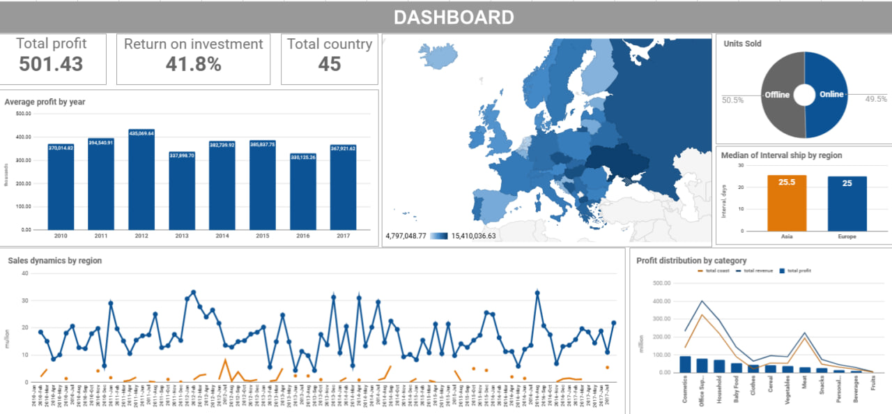

# 🛒 Sales Analysis Project

This project is a comprehensive **sales data analysis** implemented both in **Google Sheets** and **Google Colab (Python)**. The goal is to explore sales volumes, profit, ROI, and dependencies across business parameters.

---

## Data Sources

| File | Description |
|------|-------------|
| `events.csv` | Sales events data (order date, country, product, quantity, price, etc.) |
| `countries.csv` | Country data (code, region, sub-region) |
| `products.csv` | Product categories (name, ID) |

**Google Sheets (initial data exploration)**:  

[🔗 View Sheet](https://docs.google.com/spreadsheets/d/1Cvdxp6J860tB9z5PiBoqbcMVMTQd_hOG4qgKuPvaf3g/edit?usp=sharing)

---

## Python Analysis (Google Colab)

The full data pipeline was built in Google Colab:

- Load & preview data
- Clean & normalize
- Merge multiple tables
- Explore KPIs & visualize insights
- Perform geographic and categorical segmentation
- Channel performance comparison (Online vs Offline)
- Temporal & seasonal trends
- Final conclusions and strategic recommendations

---

## Key Results

| Metric | Value |
|--------|-------|
| **Total Revenue** | $1,702,129,408 |
| **Total Cost** | $1,200,694,949 |
| **Total Profit** | $501,434,459 |
| **ROI** | 41.76% |
| **Countries** | 45 |
| **Units Sold** | 6,576,524 |

---

## Insights

- **Top-profit categories**: Cosmetics, Clothes, Household
- **Highest sales volume**: Office Supplies
- **Top countries by profit**: Andorra, Ukraine, Malta
- **Balanced channel performance**: Online ≈ Offline
- **Seasonal effects**: Noticeable for Fruits (March), Baby Food (January)

---

## Tech Stack

- Python (pandas, matplotlib, seaborn)
- Google Colab (for interactive notebooks)
- Google Sheets (pre-analysis)
- GitHub (version control)
- Jupyter Notebook (.ipynb)

---

## Summary

This project demonstrates strong data preparation, exploratory analysis, and actionable business insights. It can be extended further with:

- machine learning (e.g., forecasting, segmentation),
- dashboards (e.g., Streamlit, Power BI),
- automation (e.g., Google Sheets API integration).
